# ASL Alphabet Demo

This sub-project uses ASL-inspired alphabet poses as a demo layer for the AeroHand safe motion system.

The goal is not to create a complete ASL translator. The ASL alphabet is used as a practical test set because the letters require different finger positions, thumb placements, and pose-to-pose transitions. This makes it useful for testing whether the hand can move through recognizable shapes while still using the safe transition logic from the main project.

## What This Project Does

The ASL alphabet demo lets the user type a sequence of letters and sends the matching hand poses to the AeroHand.

For each supported character, the demo:

1. Looks up the letter in `asl_alphabet.py`
2. Builds the requested hand pose or custom letter sequence
3. Adds safety-resolved transitions between letter blocks
4. Prints the final trajectory
5. Runs the trajectory on the AeroHand

## Files

| File | Purpose |
|---|---|
| `run_asl_demo.py` | Main demo script. Prompts the user for letter input, builds the trajectory, applies safe transitions, and runs the hand. |
| `asl_alphabet.py` | Stores ASL-inspired letter pose data, support status, notes, and optional custom sequences. |
| `__init__.py` | Allows this folder to be run as a Python package/module. |

This sub-project depends on the main project files:

| File | Purpose |
|---|---|
| `safe_motion.py` | Resolves safer transitions between poses. |
| `pose_math.py` | Provides pose helper functions and joint index constants. |
| `calibration/calibration_data.py` | Stores calibrated thumb clearance data used by the safety system. |

## Folder Location

Recommended location inside the repo:

```text
Maripi/
├── projects/
│   ├── __init__.py
│   └── asl_alphabet/
│       ├── __init__.py
│       ├── asl_alphabet.py
│       └── run_asl_demo.py
├── safe_motion.py
├── pose_math.py
└── calibration/
    ├── __init__.py
    └── calibration_data.py
```

## Running the Demo

Run the demo from the root of the repo, not from inside the `projects/asl_alphabet/` folder.

```bash
cd ~/Desktop/AeroHand/Maripi
python3.14 -m projects.asl_alphabet.run_asl_demo
```

If your environment uses `python3` instead of `python3.14`, run:

```bash
python3 -m projects.asl_alphabet.run_asl_demo
```

## Input Format

After running the demo, type a sequence of letters.

Example:

```text
Type a sequence of letters, or q to quit: ASL
```

Spaces are ignored.

Unsupported characters are skipped.

To quit, type:

```text
q
```

or:

```text
quit
```

or:

```text
exit
```

## Letter Data

Each letter in `asl_alphabet.py` can define:

| Field | Meaning |
|---|---|
| `pose` | Final 7-value hand pose for the letter. |
| `status` | Current support level for the robotic hand. |
| `notes` | Human-readable explanation of the pose or limitation. |
| `sequence` | Optional custom motion sequence for letters that need safer ordered movement. |

Example structure:

```python
"A": {
    "pose": [10, 55, 23, 80, 80, 80, 90],
    "status": "supported",
    "notes": "Closed fist approximation. Fingers close first, then thumb moves across.",
    "sequence": [...],
}
```

## Pose Format

Each pose is a list of 7 numeric values:

```text
[thumb_1, thumb_2, thumb_3, index, middle, ring, pinky]
```

Joint values are expected to stay within the safe motion range used by the main safety system.

## Letter Statuses

The alphabet data uses status labels to describe how well each ASL-inspired handshape works on the current hand.

| Status | Meaning |
|---|---|
| `supported` | The handshape is usable as a robotic approximation. |
| `questionable` | The handshape can be attempted, but readability or safety is limited. |
| `needs_baxter` | The handshape needs arm, wrist, or drawing motion that the hand alone cannot provide. |
| `not_possible` | The hand cannot accurately perform the required ASL handshape. |

## Custom Letter Sequences

Some letters use a custom `sequence` instead of moving directly into the final pose.

A custom sequence is used when the order of movement matters. For example, some letters need the fingers to move before the thumb, while others need the thumb to move before the fingers.

A sequence step only changes the joints listed in its `set` dictionary. All other joints keep their current values.

Example:

```python
{
    "set": {
        0: 80,
        1: 40,
        2: 40,
    },
    "duration": 0.5,
}
```

In this example, only the three thumb joints move.

## Safety Behavior

The ASL demo uses the main safe motion system between letter blocks.

When moving into a new letter, `run_asl_demo.py` calls `resolve_transition()` from `safe_motion.py`. This allows the project to insert safer intermediate steps when the thumb and fingers might otherwise move through a risky configuration.

For letters with custom sequences, the demo safety-checks the first step into the letter, then applies the rest of that letter’s internal sequence directly. This allows hand-tuned letter motions to preserve their intended order.

## Current Limitations

This project uses ASL-inspired robotic approximations, not perfect ASL handshapes.

Some letters are limited because the hand cannot fully reproduce human finger dexterity. Examples include:

- Crossed fingers
- Spreading index and middle fingers apart
- Thumb-between-fingers shapes
- Letters that require wrist orientation
- Letters that require drawing motion in space

For that reason, some letters are marked as `questionable`, `needs_baxter`, or `not_possible`.

## Example Workflow

```text
User enters: ASL
       ↓
Input is cleaned into letters: A, S, L
       ↓
Each letter is looked up in asl_alphabet.py
       ↓
Custom sequences are applied when available
       ↓
Safe transitions are inserted between letter blocks
       ↓
Final trajectory is printed
       ↓
Trajectory is sent to AeroHand
```

## Adding a New Letter or Updating a Pose

To update a letter, edit `asl_alphabet.py`.

A simple letter only needs a final pose:

```python
"B": {
    "pose": [20, 100, 70, 0, 0, 0, 0],
    "status": "supported",
    "notes": "Flat hand with thumb folded across palm.",
    "sequence": None,
}
```

Use a custom sequence when the direct transition is not safe or does not look correct:

```python
"S": {
    "pose": [90, 100, 30, 80, 80, 80, 90],
    "status": "supported",
    "notes": "Thumb moves to neutral, fingers close, then thumb comes over/across.",
    "sequence": [
        {
            "set": {0: 40, 1: 40, 2: 30},
            "duration": 0.5,
        },
        {
            "set": {3: 80, 4: 80, 5: 80, 6: 90},
            "duration": 0.5,
        },
        {
            "set": {0: 90, 1: 100, 2: 30},
            "duration": 0.5,
        },
    ],
}
```
## ASL Handshape Reference Table


| Target | Letter | Status | Robot Pose | Robot Front | Robot Side |
|---|---|---|---:|---|---|
| 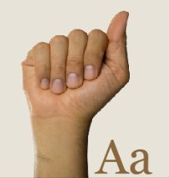 | A | supported | `[10, 55, 23, 80, 80, 80, 90]` | 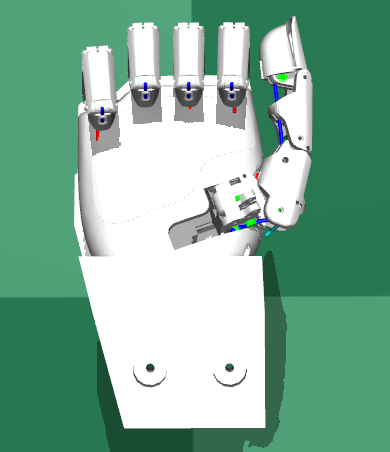 | 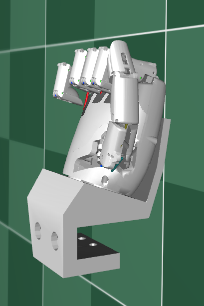 |
| 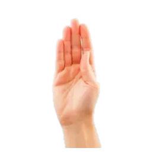 | B | supported | `[20, 100, 70, 0, 0, 0, 0]` | 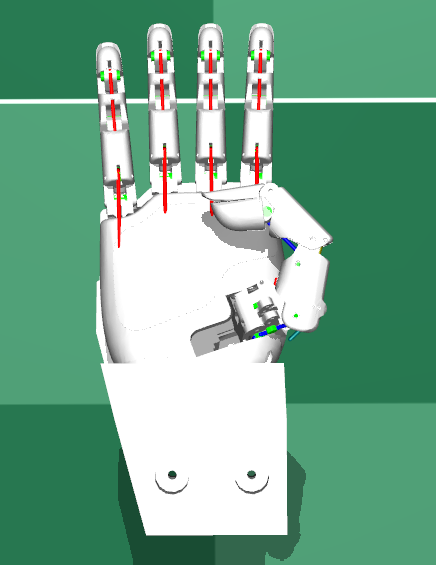 | 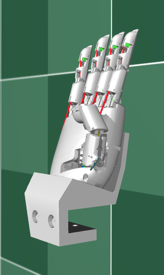 |
| 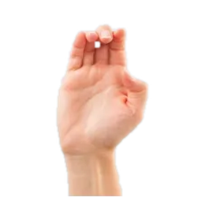 | C | supported | `[100, 20, 30, 45, 45, 45, 45]` | 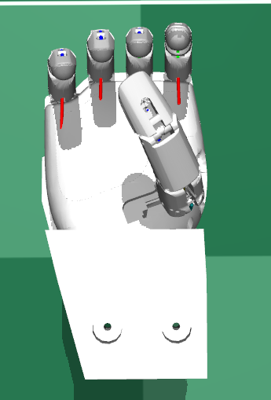 | 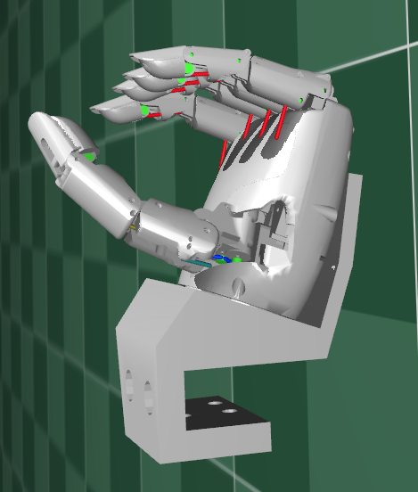 |
| 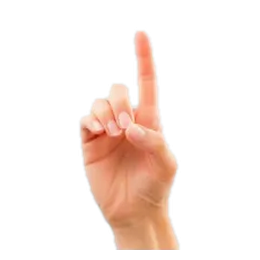 | D | supported | `[100, 25, 30, 0, 55, 55, 55]` | 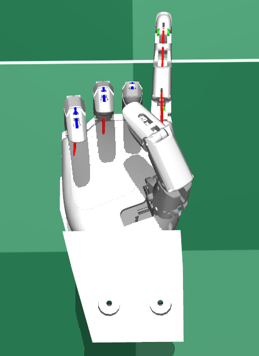 | 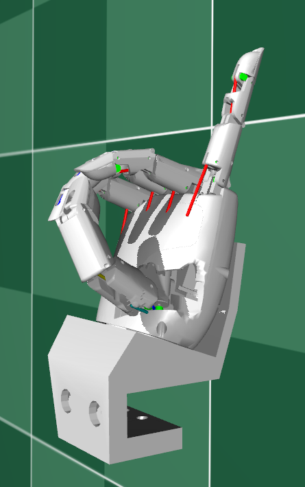 |
| 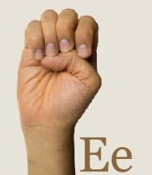 | E | questionable | `[100, 25, 30, 55, 55, 55, 55]` | 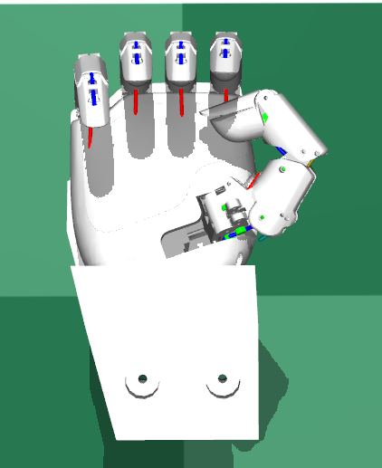 | 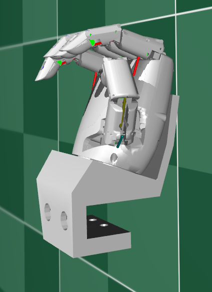 |
| 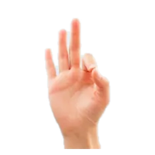 | F | supported | `[80, 25, 35, 45, 0, 0, 0]` | 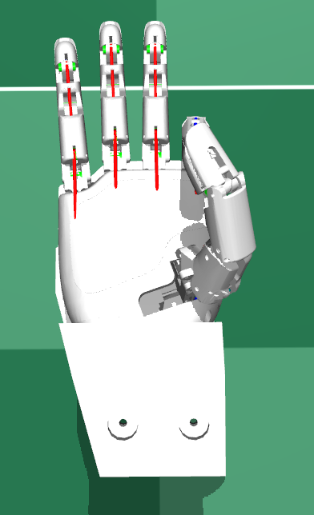 | 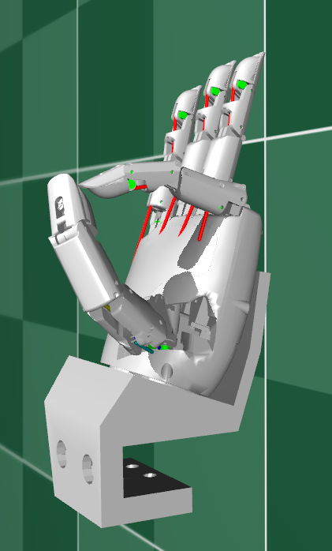 |
| 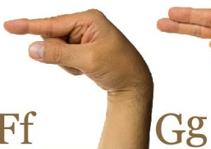 | G | needs_baxter | `[40, 80, 30, 0, 90, 90, 90]` |  | 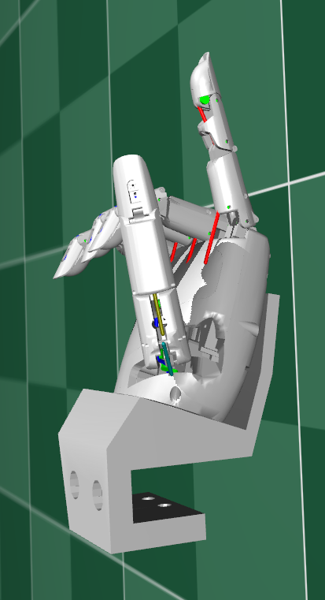 |
| 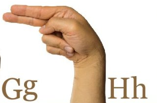 | H | needs_baxter | `[80, 100, 40, 0, 0, 90, 90]` | 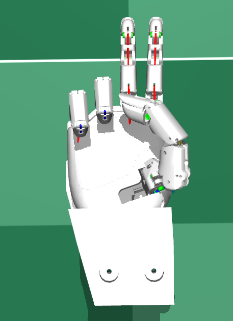 | 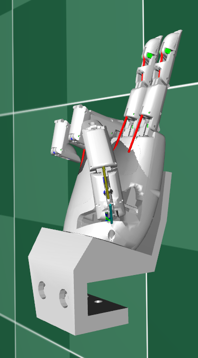 |
| 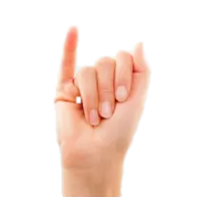 | I | supported | `[80, 40, 40, 90, 90, 90, 0]` |  | 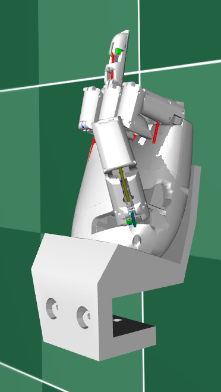 |
| 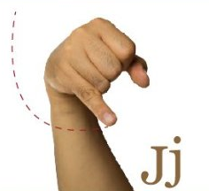 | J | needs_baxter | `[80, 40, 40, 90, 90, 90, 0]` | 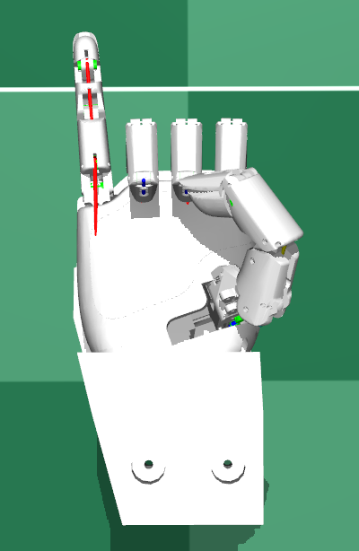 |  |
| 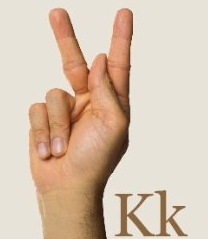 | K | questionable | `[50, 80, 40, 0, 20, 90, 90]` |  | 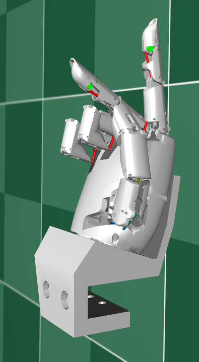 |
| 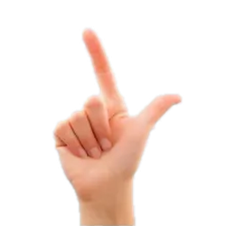 | L | supported | `[0, 0, 0, 0, 90, 90, 90]` | 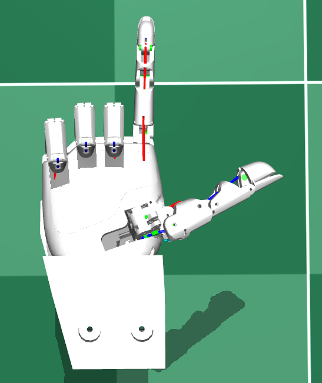 | 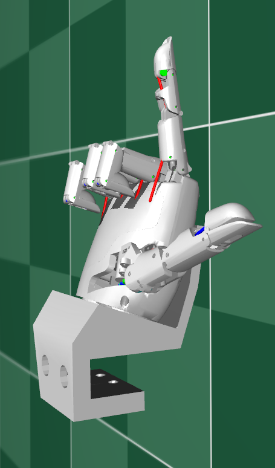 |
| 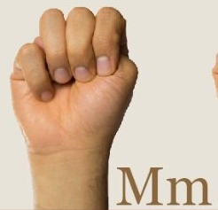 | M | questionable | `[100, 100, 40, 60, 60, 60, 60]` | 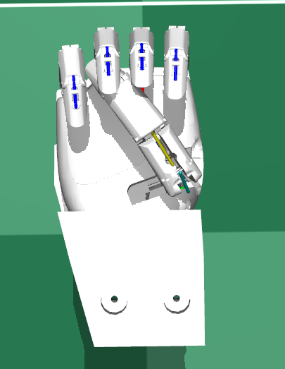 | 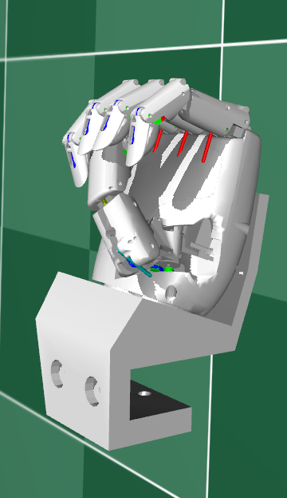 |
| 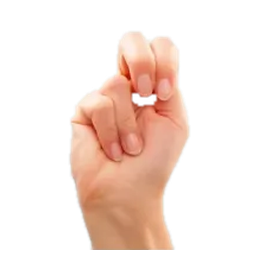 | N | questionable | `[70, 100, 40, 60, 60, 60, 60]` | 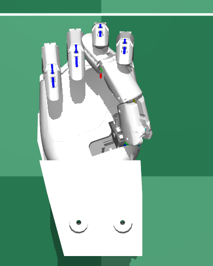 | 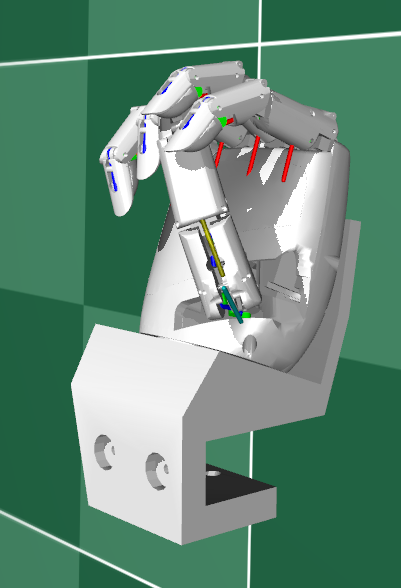 |
| 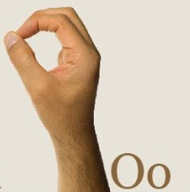 | O | supported | `[100, 30, 30, 50, 50, 50, 50]` | 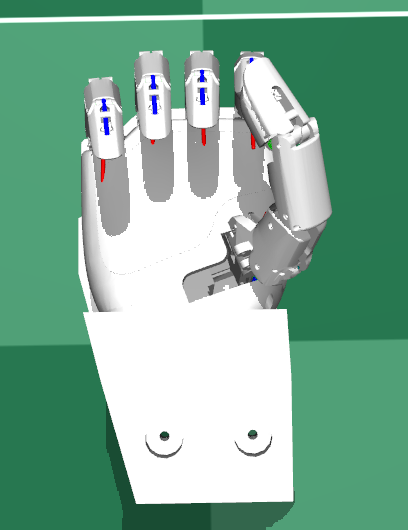 | 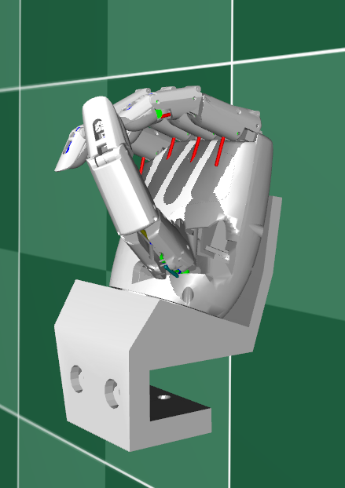 |
| 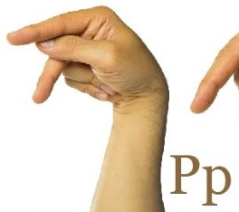 | P | needs_baxter | `[50, 80, 40, 0, 20, 90, 90]` | 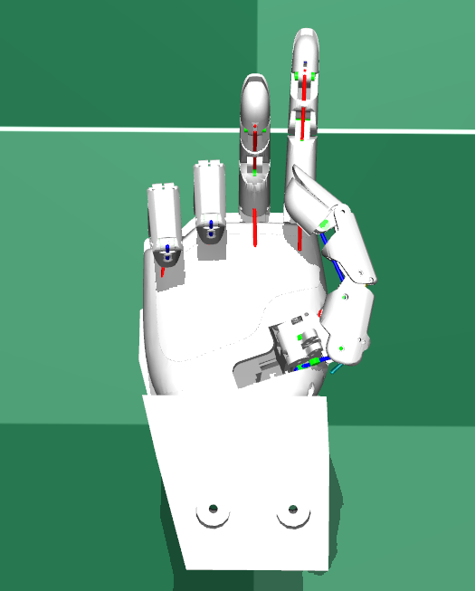 |  |
| 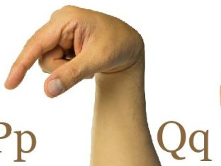 | Q | needs_baxter | `[40, 90, 15, 20, 90, 90, 90]` | 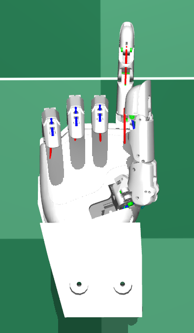 |  |
| 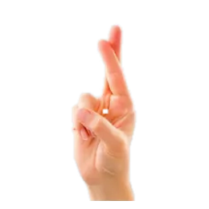 | R | not_possible | `[70, 100, 50, 0, 0, 90, 90]` | 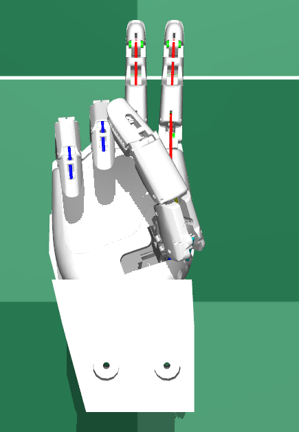 | 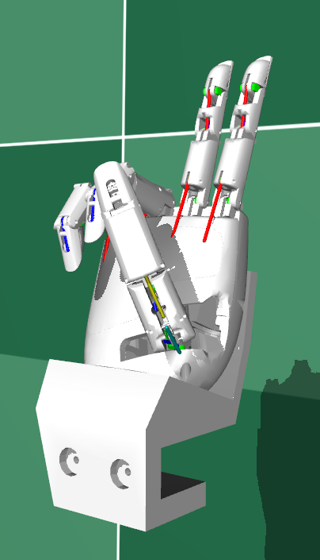 |
| 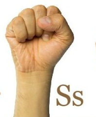 | S | supported | `[90, 100, 30, 80, 80, 80, 90]` | 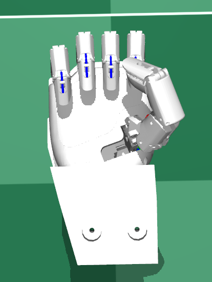 |  |
|  | T | not_possible | `[70, 85, 40, 50, 100, 100, 100]` |  |  |
|  | U | supported | `[100, 100, 30, 0, 0, 90, 90]` |  |  |
|  | V | not_possible | `[100, 100, 30, 0, 0, 90, 90]` |  |  |
|  | W | questionable | `[100, 100, 30, 0, 90, 90, 90]` |  |  |
|  | X | questionable | `[100, 100, 30, 30, 90, 90, 90]` |  |  |
|  | Y | questionable | `[0, 90, 0, 90, 90, 90, 0]` |  |  |
|  | Z | needs_baxter | `[100, 100, 30, 0, 90, 90, 90]` |  |  |
